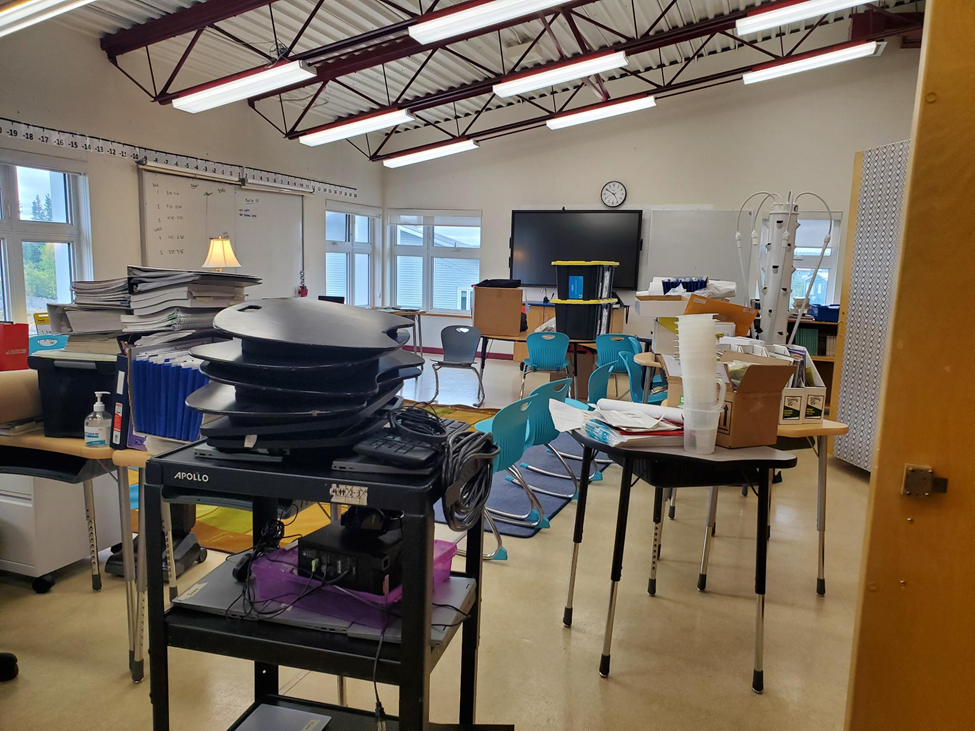

## Week Two: School’s already begun!

It’s been a couple of weeks in Tsiigehtchic so far. The last two weeks have been overwhelming. When we arrived at school, there was no working internet. Not so easy when a technician is a day’s drive away, and most of the school information (for example, what courses we are running this year) is stored in the “cloud”. For the first week, then, all we could do was prepare our classroom.⁠

That was several day’s work on its own. We found mountains of textbooks, science equipment, art supplies, old notebooks, student work from previous years. We started by pulling everything out of the cupboards, and shelves and closets. Our goal was to set up a classroom where students could see themselves represented in the room, rather than overwhelmed by rows of math and science and English textbooks crowding the shelves.

All this time, we had a lingering questions: what courses are we teaching this year? I knew I was hired to teach humanities, but what does that mean? English? History? Geography? We had no answers because we had no internet. We did our best to piece together what courses were being offered by looking at last year’s paper files. We found some transition documents from last year that helped too.

It wasn’t just internet that complicated things. Last year’s principal was going to come and help us get oriented in the school, but something unexpected came up, and made her unavailable. Our assistant superintendent did everything she could to support us, while also supporting each of the other forty-something schools in the district. We all did our best with the resources we had on hand. It felt overwhelming at times. It took a few days, working with the other high school teacher, Principal, and support teachers, to finalize a school calendar for the students.

It’s true the work was overwhelming, but it offered a view of school administration that I don’t think I would have seen any other way. I imagine in most cases (and what I’d expected) was that a principal would hand me my course schedule and class list, and say “there you go.” These last few weeks we were very much involved in the administrative process of setting up the school. We had to look at the school as a whole, and coordinate our class schedules so that we didn’t overlap gym times, classroom space, or have two teachers potentially in two places at the same time. It reminded me of Hermione from Harry Potter, who had a special hour glass that let her take two classes at the same time. If only we’d had one of those.

We figured it out the day before classes started. We had a schedule, and we had an organized classroom. I and the other high school teacher went home, exhausted, having spent the last week and a half, each day at the school, some days from 7am to 10pm, including weekends to get the school ready. We were exhausted walking home around 10pm. We only had the small final task of figuring out what our lesson plans would be for the next day. The night passed in a blur, but we came together with an outline for our classes, and fell asleep sometime well after midnight.

We got away from the school a few times during the week. One of the other teachers took us on a walk around Tsiigehtchic, and introduced us to a number of people. One of the families we met was outside their house, smoking and fileting fish they’d caught earlier in the day. They invited us to join them the next afternoon if we wanted to help with the fishing.

The next afternoon, the other high school teacher and I went over to their place. We were welcomed into their kitchen for tea, talked a bit about where we were from. In the background a radio played music from a Yellowknife radio station. They explained there was also a Tsiigehtchic FM radio station that worked, but usually had no one on the air. (It’s 99.9 FM. I’m told you need to be within a short radius of Tsiigehtchic to pick it up) They told us that in past years students used to get on the radio and wish good morning to the Elders of Tsiigehtchic. I’m hoping our students will have a chance to do something similar.

Around 3pm, the family’s father came in. I offered to help him with his fishing nets. He said sure, and I followed him out to a pickup truck parked behind their house. It had a cracked windshield, dented fender, and the door only opened from the inside. We loaded a large Rubbermaid bin in the bed. Standing on the cool, dusty gravel ground, I felt like a Cape Breton fisherman. I climbed in the passenger side. He turned the key, and the engine fired to life. The radio played local country music as we bounced down the gravel road to the ferry landing.

We reached the water, where their fish nets were, in a few minutes. Once there, we got out of the truck. I walked down with him to the water’s edge. He pointed to a small, sturdy-looking, aluminum fishing boat. I stepped in, noticing inside there was a few more Rubbermaid bins, a chainsaw, a paddle, axe, and a stern-drive engine. I had just a moment to sit down, when he untied the boat, and pushed it off the muddy bank into the water.

I expected he was going to fire up the engine. Instead, he picked up the spare paddle, and paddled hard against the wind, towards a small foam block, floating just off shore. Once close enough, he pulled up a thin rope. It ran about twenty feet from where we were, perpendicular to the shore, towards the centre of the river. All along the rope was a net that hung down about two and a half feet into the water. He asked me to hold the rope up out of the water. Together we pulled hand-over-hand along the rope towards the centre of the river.

After just a few feed, the line started to get heavy. He pulled it up, and lifted out a two and a half-foot fish, tangled in the net. He worked to untangle the fish, pulled it from the water, and dropped in one of the Rubbermaid bins in the fishing boat. We pulled along the rope a bit further, and another fish came up, also over two-feet long. Within five minutes, he’d pulled in about twelve fish. He told me what they were: Perch, jackfish (they had a solid mouth of teeth, and had to be knocked out with a stick before he could untangle them), Whitefish, and Coney (or Inconnu).

After we’d cleared the entire net, he fired up the engine on the motorboat, and drove us back in to shore. I helped him carry the bin up and in to the truck. He closed the bed, and moments later we were driving back up the gravel road to their house.

Once back, we were part of a whole family operation. They laid all the fish out on a wooden, elbow-height shelf. The family’s mom took out a large fish knife, and removed the heads of each of the fish, allowing them to drain into a Rubbermaid bucket. She showed both the other teacher, and I, how to fillet a fish. Once we’d finished, she put our fillet into a bag, and handed them to us to take home.

We both walked home that evening with enough fish to last us for lunch and dinner for the next couple days. We’d made also a remarkable new connection to the community. Few things could have been as welcoming as being invited into someone’s kitchen, to sit, and talk over tea.

All this happened a few weeks ago. Since then, school has started, classes are running, and we’re into our second week of school. We’ve been out berry picking, invited Elders from the community to come and speak to our students, met a number of the parents, been invited to a community dinner last Friday. We set-up our Starlink on the roof of the apartment, played cello and guitar with the ferry Captain who operates the MV Louis; the ferry that takes cars travelling the Dempster Highway across the Mackenzie River. I’ve made a pot of moosemeat stew, and enjoyed fish dinner, caught fresh from the Tsiigenjik River, with other staff from the school. We’ve had dinner with the other school staff, and dinners with the entire community. All the while, we’ve been keeping up with planning and teaching our classes each day. I’ll write up some of these stories soon. It’s been humbling, overwhelming, inspiring, exciting, and exhausting, all at the same time.

Until next weekend!
